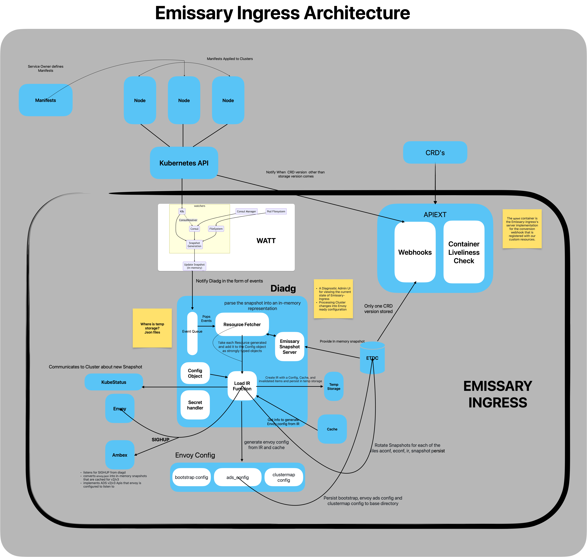

# Self-assessment
The Self-assessment is the initial document for projects to begin thinking about the
security of the project, determining gaps in their security, and preparing any security
documentation for their users. This document is ideal for projects currently in the
CNCF **sandbox** as well as projects that are looking to receive a joint assessment and
currently in CNCF **incubation**.

For a detailed guide with step-by-step discussion and examples, check out the free 
Express Learning course provided by Linux Foundation Training & Certification: 
[Security Assessments for Open Source Projects](https://training.linuxfoundation.org/express-learning/security-self-assessments-for-open-source-projects-lfel1005/).

# Self-assessment outline

## Table of contents

* [Metadata](#metadata)
  * [Security links](#security-links)
* [Overview](#overview)
  * [Actors](#actors)
  * [Actions](#actions)
  * [Background](#background)
  * [Goals](#goals)
  * [Non-goals](#non-goals)
* [Self-assessment use](#self-assessment-use)
* [Security functions and features](#security-functions-and-features)
* [Project compliance](#project-compliance)
* [Secure development practices](#secure-development-practices)
* [Security issue resolution](#security-issue-resolution)
* [Appendix](#appendix)

## Metadata

A table at the top for quick reference information, later used for indexing.

|   |  |
| -- | -- |
| Software | [emissary](https://github.com/emissary-ingress/emissary)  |
| Security Provider | No |
| Languages | Python, Golang, make, shell, html, dockerfile |
| SBOM | Software bill of materials. https://github.com/emissary-ingress/emissary/blob/master/go.mod and https://app.fossa.com/attribution/2a534448-1fa3-442b-b385-caa8c1178c99 |
| | |

### Security links

Provide the list of links to existing security documentation for the project. You may
use the table below as an example:
| Doc | url |
| -- | -- |
| Security file | https://github.com/emissary-ingress/emissary/blob/master/DevDocumentation/SECURITY_RELEASE_PROCESS.md |
| Default and optional configs | https://www.getambassador.io/docs/emissary/latest/topics/running/environment |

## Overview

Formerly known as the Ambassador API Gateway,[Emissary-Ingress](https://www.getambassador.io)([emissary](https://github.com/emissary-ingress/emissary/tree/master )) project is an open-source API gateway that is native to Kubernetes that lets you control inbound traffic to your apps in a Kubernetes cluster. Ingress in Kubernetes refers to controlling external access to services that are operated within the cluster.

### Background

Understanding the importance and effects of Emissary Ingress in handling incoming traffic inside Kubernetes clusters would be made easier with some familiarity with the ideas surrounding Kubernetes (Ingress, Services, etc.). Within Kubernetes, Emissary Ingress functions as an Ingress controller. The Kubernetes cluster's ingress controllers manage incoming external traffic and route it to the relevant services.

[Envoy Proxy](https://www.envoyproxy.io) serves as the foundational data layer for Kubernetes traffic control as well as administration in Emissary Ingress. Designed specifically to manage incoming traffic in Kubernetes settings. With its simple user interfaces and Kubernetes-native options, Emissary Ingress simplifies and facilitates the use of Envoy Proxy in Kubernetes installations. 			Advanced traffic routing capabilities are made possible by this open source project, which offers customisable routing based on hostnames, HTTP URLs, headers, and other parameters. To provide traffic splitting criteria, Emissary Ingress makes use of the Ingress resources provided by Kubernetes or custom annotations. These rules may be predicated on a number of variables, such as HTTP pathways, headers, or the proportion of traffic that is routed to distinct service versions. This makes managing load and traffic control between multiple services easier. It also has the capabilities like SSL termination, [rate limiting](https://www.getambassador.io/docs/emissary/latest/topics/running/services/rate-limit-service), [TLS](https://www.getambassador.io/docs/emissary/latest/howtos/tls-termination), [load balancing](https://www.getambassador.io/docs/emissary/latest/topics/running/load-balancer), traffic splitting, [authentication](https://www.getambassador.io/docs/emissary/latest/topics/running/services/auth-service) and routing, emissary-ingress serves as a control plane for managing traffic that arrives. It is designed to function effectively in a micro services architecture, enabling adaptable traffic control and routing settings.

Emissary Ingress allows for flexible traffic distribution by supporting dynamic routing depending on a variety of parameters, including HTTP pathways, headers, and hostnames. It also allows traffic to be switched between multiple service versions, making canary deployments, A/B testing, and incremental rollouts smoother and provides flexibility and scalability by enabling specific control over service routing and traffic flow. Because it can manage TLS certificates and handle SSL termination, it improves the security of incoming traffic and enables protected routing traffic.  Kubernetes's capabilities are improved by Emissary Ingress, which makes it simpler to handle incoming traffic, put routing plans into place, and improve security. In order to properly utilise Emissary-ingress, we usually want to install it within our Kubernetes cluster, set it up to handle incoming traffic based on the needs of our application, and then manage it using Kubernetes resources such as custom settings, annotations, or Ingress objects.

### Actors

|   |     |
| -- | -- |
| Platform Adminstrators| Those who modify the configurations of the API gateway. Main focus on maintaining the Platform|
| Application Developers| Can Modify the Configuration of the API Gateway. Access only limited to Mapping and Routing Configurations|
| External Users| All the users whose request go through API Gateway|
|Apiext Server| Implements the Webhook Conversion interface for CRDs.|
|Diagd (Diagnostic Admin UI and Config Processor)| Provides a diagnostic admin UI, processes cluster changes into Envoy-ready configuration.|
|Ambex (gRPC Server for Envoy xDS)| Implements xDS APIs for dynamic Envoy configuration.|
|Envoy Proxy| Handles routing for all user traffic, dynamically updated using xDS services.|
|Ambassador Agent| Provides connectivity between the cluster and Ambassador Cloud.|
|Watch All The Things (Watt)| Watches for changes in the Kubernetes cluster, Consul, and the file system.|
|Entry Point (Entrypoint Binary and Busyambassador) | Manages the startup and coordination of various components in the container.|
| | |

### Actions

Emissary-ingress allows users and services to perform the following core actions:

Action      | Actors | Description     |
| :---       |    :----  |          :--- |
| Handling Ingress Traffic      |  Emissary-ingress, Kubernetes API      | Emissary checks the format of HTTP requests for protocol standard compliance, then validates the identity of incoming requests based on the preferred method of authentication (API tokens, certificates, et cetera) and RBAC. Rate limiting features limit service abuse. Envoy handles incoming and outgoing traffic amidst Kubernetes providing information about services and cluster management. Envoy handles rate limiting and TLS termination for abuse protection and data encryption/decryption for data passage to and from backend services.   |
| Request to Service Routing   | Emissary-ingress, Envoy       | Emissary routes incoming requests to its corresponding backend service based on rules and administrator configurations while Envoy executes routing decisions and forwards requests. Both actors validate paths against routing rules, validate headers for destination routing and injection prevention. Emissary also enforces any host-based routing rules.      |
Load Balancing | Emissary-ingress, Envoy | Emissary executes load balancing decisions based on rule configurations while Envoy implements the load balancing via request distribution across multiple instances of a service. Health checks of backend services are checked regularly and adjusted as necessary to avoid system freezing or downtime. Access to this service is restricted given the nature of the data handled (personally identifiable information [PII], backend service information, et cetera).
Monitoring and Logging | Emissarry-ingress, Envoy, Kubernetes API, Administrator | Emissary-ingress will get its information from Kubernetes’ K8s cluster by watching for configuration settings within K8s resources, as well as Emissary’s CRD Resources. A consulWatcher is started if a user has configured a mapping to use ConsulRevolver. Admins utilize logging features to monitor and log activities that occur within Emissary and review them as needed for suspicious activities and/or incidents that require immediate attention and remediation.
Data Flow | Watt | Watt begins end-to-end data flow from developer configurations to Envoy configurations.

### Goals
Goal of emissary-ingress is to act as more native to kubernetes solution for a API Gateway, which supports functions like Layer 7 load balancer + Kubernetes Ingress built on Envoy Proxy. emissary achieves these functionalities leveraging envoy features and kubernetes features.
* provide a ingress solution with easy to setup configuration.
* Self service capabilities that decouples developers from the platform team.
* A control plane for envoy that provides extensive configuration capabilities interms of routing,
  filtering, rate limiting, TLS support.
* Integrations and extensibility of features like authServices, rate limiting, service mesh, access controls.
* Maintaining resiliance and performance as a API gateway.

#### Security Goals 
* Protect the declarative configurations such that no bad actor could modify them intern effect routing paths of the service.
* Ensure that communication between Emissary-ingress components and other services is encrypted using secure protocols, such as TLS.
* Provide logs and audit trails for actions and events within Emissary-ingress to support security monitoring and incident response.
* Provide robust authentication features such that unpermitted accesses are allowed entry to the cluster
* Ensure that default configurations follow security best practices and do not expose unnecessary services or features.

### Non-goals
- Emissary-ingress doesn't protect against risks such as Kubernetes API Server Bypass, which could have in a few number of ways with bad actors modifiying cluster configurations.
https://kubernetes.io/docs/concepts/security/api-server-bypass-risks/
- Emissary-ingress is not responsible for the security of the applications it routes traffic to. Application security is the responsibility of application developers and operators.
- Emissary-ingress may not handle external user authentication directly.
- Emissary-ingress focuses on managing external traffic at the edge and may not directly control or secure internal network communications.
- Emissary-ingress may not handle encryption key management for applications.

## Self-Assessment Use

This self-assessment is created by the [emissary-ingress] team to perform an internal analysis of the
project's security.  It is not intended to provide a security audit of [emissary-ingress], or
function as an independent assessment or attestation of [emissary-ingress]'s security health.

This document serves to provide [emissary-ingress] users with an initial understanding of
[emissary-ingress]'s security, where to find existing security documentation, [emissary-ingress] plans for
security, and general overview of [emissary-ingress] security practices, both for development of
[emissary-ingress] as well as security of [emissary-ingress].

This document provides the CNCF TAG-Security with an initial understanding of [emissary-ingress]
to assist in a joint-assessment, necessary for projects under incubation.  Taken
together, this document and the joint-assessment serve as a cornerstone for if and when
[emissary-ingress] seeks graduation and is preparing for a security audit.

## Security Functions and Features

* Authentication: Emissary-ingress utilizes AuthService, a custom resource allowing users to provide an endpoint for authentication services. Once configured, each request hitting Emissary triggers Envoy to send a copy of that request to the service specified within an AuthService custom resource. This allows the service to inspect virtually any aspect of the request, including the header, protocol, and scheme. The service can then modify headers as it desires for request header sanitizing or the addition of them, further allowing requests to be routed or denied with a custom error response sent back to the request sender.
* Rate Limiting: The RateLimitService is a custom resource that also allows users to provide information about services that Emissary should reach out to for incoming requests regarding rate limiting decisions. Service implementations should be provided and will allow users to attach custom labels to requests, attach labels to request properties (client IP, hostnames, et cetera), and rate limit based on keys.
* TLS Support: A wide variety of configuration options for TLS is available to users and allows them to specify the minimum or maximum version of TLS allowed, require client certificates, specify a list of permitted cipher suites and ECDH curves, and provide a certificate revocation list.
* Availability: Built-in configuration options for CORS and circuit breaker configurations are available for use to help prevent service overloading. Configuring the maximum number of simultaneous connections, requests, pending requests, and retries prevent system abuse alongside IP allow and deny list configurations. For more specific use cases, several other miscellaneous options are available, including Lua scripts that run on each request. For example, with Lua, users commonly remove request headers before reaching AuthService and RatelimitService so that they can add custom headers that correspond to billing or authentication purposes, preventing end users from spoofing them.
* Filtering Malicious Traffic: Emissary maintains a publicly available Web Application Firewall configuration based on the OWASP core rule set. This satisfies PCI 6.6 compliance requirements and enables users to further configure their own custom security on the firewall.
* Observability: Access logs are placed on stdout for reading using kubectl logs. Format and local destination can be configured to the administrator’s wishes while using envoy_log_ settings. Information collected includes service, driver (HTTP or TLS), driver configuration, additional log headers, the maximum number of seconds to buffer access before sending logs to ALS, and a soft size limit for the access log buffer, among other options.
* Emissary-ingress puts the access logs on stdout for reading using kubectl logs. Local destination and log format can be configured to the administrator’s wishes using envoy_log_ settings, however these options only allow for logging locally to Emissary-ingress’ Pod. Information collected includes but is not limited to service, driver (HTTP or TLS access), driver configuration, additional log headers, the maximum number of seconds to buffer access before sending them to ALS, and a soft size limit for the access log buffer.

## Project compliance

* Compliance.  List any security standards or sub-sections the project is
  already documented as meeting (PCI-DSS, COBIT, ISO, GDPR, etc.).
  - PCI DSS 6.6 compliance

## Secure development practices

Emissary-Ingress is in progress with 94% in Open Source Security Foundation (OpenSSF) best practices. 

* Development Pipeline.  A description of the testing and assessment processes that
  All code is maintained in [GitHub](https://github.com/emissary-ingress/emissary) and changes must be reviewed by maintainers.
  - All the source code is publicly available on github
  - Development process is done through PRs on the master branch only, and Issue led [Issue Template](https://github.com/emissary-ingress/emissary/blob/master/.github/ISSUE_TEMPLATE/Feature_request.md).
  - Extensive documentation, resolution and targetted versions for the changes are required to be added to the Issue.
  - Every PR requires thorough testing, lint checks and corresponding Docs updation.
  - Commits need to be signed off and commit msgs are expected to be descriptive, include Issue links.
  - Each PR requires minimum 2 reviewer sign offs to be merged, and Maintainers will merge the PR.
  - All of the release branches are long-lived and have branch protection enabled, which will be used for security fixes or bug fixes.
  - Backport statergy: majority of the time patch branch will be based off from master and most Pull Requests will target master. ensuring bugs and fixes arent missed in the Next shipping version.
  - All PR requests trigger jobs that perform as listed here [jobs](https://github.com/emissary-ingress/emissary/blob/master/.github/workflows/execute-tests-and-promote.yml#L318):
    - Unit Tests
    - linting checks for code quality.
    - Checks for Envoy protobuf changes to find impact on code.
    - Validation of Envoy version.
    - Integration Tests.
    - Validation of Helm chart changes.
    - Builds and updates container image and the registry.
    - Container image scanning for vunerabilities(trivy)
    - E2E tests are also run frequently.
* Release process:
  - emissary-ingress has well organised security release process with dedicated team that responds to vulnerabilites quickly as described in [Secure release process](https://github.com/emissary-ingress/emissary/blob/master/DevDocumentation/SECURITY_RELEASE_PROCESS.md)

* Communication Channels. Reference where you document how to reach your team or
  describe in corresponding section.
  * Internal. How do team members communicate with each other?
    Team members communicate with each other through the [Community Slack](https://a8r.io/slack), [Github issues](https://github.com/emissary-ingress/emissary/issues) or [Zoom meetings](https://ambassadorlabs.zoom.us/j/86139262248?pwd=bzZlcU96WjAxN2E1RFZFZXJXZ1FwQT09).
  * Inbound. How do users or prospective users communicate with the team?
    Users communicate with the team through the [Community Slack](https://a8r.io/slack), [Github issues](https://github.com/emissary-ingress/emissary/issues) or [Zoom troubleshooting meetings](https://us02web.zoom.us/j/83032365622).
  * Outbound. How do you communicate with your users? (e.g. flibble-announce@
    mailing list)
    Team members communicate with users through the [Community Slack](https://a8r.io/slack).

* Ecosystem. How does your software fit into the cloud native ecosystem?
 Emissary-ingress is a specialized control plane for Envoy Proxy. In this architecture, Emissary-ingress translates configuration (in the form of Kubernetes Custom Resources) to Envoy configuration. All actual traffic is directly handled by the high-performance Envoy Proxy. It can route traffic to kubernetes services and directly to the pods aswell as integrate with service meshes like consul, linkerd, isito.

## Security issue resolution

Related security flaws may be reported over the Slack channel or by email to the emissary ingress team. The group responds expeditiously.
In addition, users may visit [status.getambassador](https://status.getambassador.io/) where any problems that arise while the active products (Emissary, Edge Stack, Telepresence, Ambassador Cloud) are being fixed will be reported.

**Responsible Disclosures Process**

Assisting with the vulnerability fix, the emissary ingress works with The Common Vulnerability Scoring System (also known as CVSS Scores). In Detail, As soon as the team is able to put up the fix, a patched version will be made available for serious severity problems .The issues with Medium CVSS score will be fixed in the next version, which usually happens in 4-6 weeks or less. In a later version, they address Low 

**Incident Response**

As an API gateway that manages incoming traffic in Kubernetes clusters, Emissary Ingress concentrates on averting any security risks by taking a number of steps. After assigning the issue to a maintainer. The maintainer will investigate a known or existing CVE to determine the problem and the circumstances in which it may be exploited. They will next examine the Emissary/Edge Stack codebase to see if any of the packages listed in the CVE are being used. Or is this merely a matter of a scanner seeing that we have an earlier version of the dependency, or would they really call any of the methods particular to the CVE. If it is not an known vulnerability then maintainers Examine the source to see if there are any exploitable vulnerabilities that are calling functions that are a part of a susceptible package.

whether the problem is serious enough or not , Ambassador Labs and Engineering leadership will analyse it to see whether sending out emails or Slack notifications to users is a required outreach for high enough priority topics. Since Emissary is a distributor of Envoy Proxy, whenever a new CVE is discovered in Envoy, we have time to update Emissary to the most recent builds of Envoy and prepare a release for release as soon as the specifics of the security flaw are made public. 

## Appendix

* Known Issues Over Time. List or summarize statistics of past vulnerabilities
  with links. If none have been reported, provide data, if any, about your track
record in catching issues in code review or automated testing.
  - [2.2.1](https://www.getambassador.io/docs/emissary/latest/about/known-issues#221) TLS certificates using elliptic curves were incorrectly flagged as invalid. This issue is corrected in Emissary-ingress 2.2.2.
  - [security compliance issues](https://github.com/emissary-ingress/emissary/issues?q=is%3Aissue+label%3Asecurity%2Fcompliance+is%3Aopen) lists the active issues in security and compliance.
* [CII Best Practices](https://www.bestpractices.dev/en/projects).
  Emissary-Ingress is in progress with 94% in Open Source Security Foundation (OpenSSF) best practices. .
  - unknown status of dynamic code analysis as: It is SUGGESTED that at least one dynamic analysis tool be applied to any proposed major production release of the software before its release.
  - unknown status of The process for reporting vulnerabilities on the project site. (missing URL)
  - If private vulnerability reports are supported, the project MUST include how to send the information in a way that is kept private. (missing URL)
* Case Studies.
  emissary is used by various companies in areas such as API gateways, ingress solution, they also often leverage its integration with various service meshes.
  - AppDirect is a subscription commerce platform that helps businesses buy, sell, and manage technology. It combines data, infrastructure, and identity and access management functions.
    - They were facing issues with multi tenancy and client integrations while trying to migrate their systems to microservice based  architecture backed by kubernetes.
    - They concluded that they need an API gateway that would do authentication, TLS support, tracing, canary support.
    - Envoy was fitting the description for their use case but given how complex configuring it is and building a control plane from scratch 
      isnt an easy task, they chose to use emissary.
    - emissary-ingress was adopted into their model where its extensively used for tracing, metrics, rate-limiting, and many more features it offers.
  - GoSpotCheck is a mobile task management platform for teams that connects frontline employees with corporate goals and directives, creates a shared view of the field, and helps leaders make better decisions, faster.
    - They were trying to migrate from heroku to kubernetes and were looking for solutions to Host the existing applications migrating from Heroku, Accommodate the new microservices architecture, Support multiple independent development teams.
    - An early need identified was an ingress controller and/or API gateway. it had to be native to Kubernetes and cloud-vendor neutral.
    - it needed to be able to route traffic in development, staging, and production clusters. Some of the services needed routing based on the domain name, and others needed routing based on the path. multiple teams both working and adopting the new platform at different speeds, so using the features had to be autonomous. It had to integrate well with Fastly(WAF). Using Helm charts for deploying applications, so the gateway would have to allow configuration through code. Needed observability of the gateway itself and the traffic coming through it, in Prometheus metric format.
    - Emissary-ingress was the perfect fit for their usecase, it was capable of doing everything in their requirements and was adopted into the system. And stayed constant through the evolution of the system.
* Related Projects / Vendors.
  - Amazon API Gateway: a fully managed service that makes it easy for developers to create, publish, maintain, monitor, and secure APIs at any scale. The management interfaces on traditional API gateways are not designed for developer self-service, and provide limited safety and usability for developers. whereas emissary-ingress supports self-service and designed to work in cloud native env.
  - Kong: a lightweight, fast, and flexible cloud-native API gateway.Kong Gateway runs in front of any RESTful API and can be extended through modules and plugins. It’s designed to run on decentralized architectures, including hybrid-cloud and multi-cloud deployments.
  Kong is defined more towards API managment rather than for managing microservices which is the major difference with emissary-ingress.
  - Isito: an open-source service mesh, built on Envoy. A service mesh is designed to manage East/West traffic (traffic between servers and your data center), while an API gateway manages North/South traffic (in and out of your data center). North/South traffic is quite different from East/West traffic (i.e., you don't control the client in the North/South use case). which emissary-ingress's prime focus.
  Isito can be integrated with emissary such that isito handles east/west while emissary-ingress handles north/south.
*References
[Amazon Web Services](https://aws.amazon.com/api-gateway/)
[Kong](https://docs.konghq.com/gateway/latest/)
[Isto](https://istio.io/latest/about/service-mesh/)
